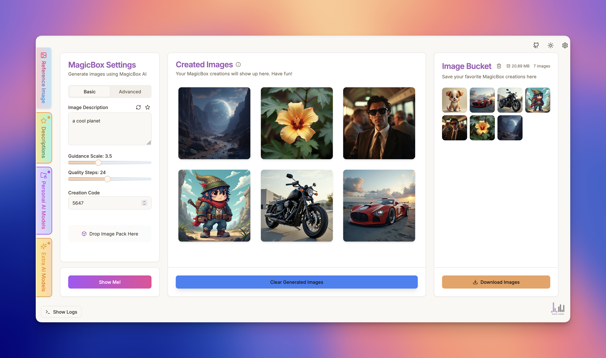

# Replicate Image Generator

Replicate Image Generator is a web application that allows users to generate images using the FlUX.1 image generation models (dev, pro, pro-ultra and schnell versions) hosted on Replicate. Additionally, images may be generated using both Recraft v3 models (image and SVG). This project is built with Next.js to provide a user-friendly interface for image generation.




## Features

- Generate images using Flux.1 AI models (dev and schnell versions) through the Replicate API
- Customize image generation parameters such as prompt, aspect ratio, and more
- Support for private LoRA models
- Secure handling of API keys (stored in browser's local storage)
- View and manage generated images

## Installation

1. Clone the repository:
   ```
   git clone https://github.com/ashakoen/next-js-flux1-replicate.git
   cd next-js-flux1-replicate
   ```

2. Install frontend dependencies:
   ```
   npm install
   ```

3. Start the development server:
   ```
   npm run dev
   ```

## Usage

1. Open your browser and navigate to ``` http://localhost:3000 ```
2. Enter your Replicate API key in the designated field
3. Configure your image generation parameters
4. Select either the "dev" or "schnell" version of the Flux.1 model
5. Click "Generate Image" to create new images
6. View and manage your generated images in the gallery section

## Security Note

The user's Replicate API key is stored securely in the browser's local storage and is not persisted in the backend. The frontend directly calls the Replicate API using the user's API key. Always ensure you're using the application over a secure connection (HTTPS) in production environments.

# Project Structure

```
.
├── Dockerfile
├── LICENSE
├── README.md
├── components.json
├── docker-compose.yml
├── next-env.d.ts
├── next.config.mjs
├── package-lock.json
├── package.json
├── postcss.config.mjs
├── public
│   └── next.svg
├── src
│   ├── app
│   │   ├── api
│   │   │   └── replicate
│   │   │       └── route.ts
│   │   ├── components.tsx
│   │   ├── favicon.ico
│   │   ├── globals.css
│   │   ├── layout.tsx
│   │   └── page.tsx
│   ├── components
│   │   └── ui
│   │       ├── accordion.tsx
│   │       ├── alert.tsx
│   │       ├── button.tsx
│   │       ├── card.tsx
│   │       ├── dialog.tsx
│   │       ├── drawer.tsx
│   │       ├── input.tsx
│   │       ├── label.tsx
│   │       ├── select.tsx
│   │       ├── skeleton.tsx
│   │       ├── slider.tsx
│   │       ├── switch.tsx
│   │       ├── tabs.tsx
│   │       ├── textarea.tsx
│   │       └── tooltip.tsx
│   └── lib
│       └── utils.ts
├── tailwind.config.ts
└── tsconfig.json
```

## Key Components

### Frontend

- Built with Next.js and React
- Tailwind CSS for styling
- UI components from Radix UI

## Configuration

This project doesn't use environment files (.env) for configuration. Instead, sensitive information like API keys are handled directly in the frontend and not stored in the backend.

### API Key Handling

- The Replicate API key is entered by the user in the frontend interface.
- The API key is stored in the user's browser local storage for convenience.
- When making requests, the frontend uses the API key to authenticate with the Replicate API.

### Frontend Configuration

You can customize various aspects of the frontend by modifying the following files:

- `next.config.mjs`: Next.js configuration
- `tailwind.config.ts`: Tailwind CSS configuration
- `tsconfig.json`: TypeScript configuration

Remember to never commit sensitive information like API keys to your version control system.

## Contributing

Contributions are welcome! Please submit a pull request.

## License

This project is licensed under the MIT License. See the LICENSE file for details.

## Contact

For any questions or suggestions, please open an issue on the GitHub repository.